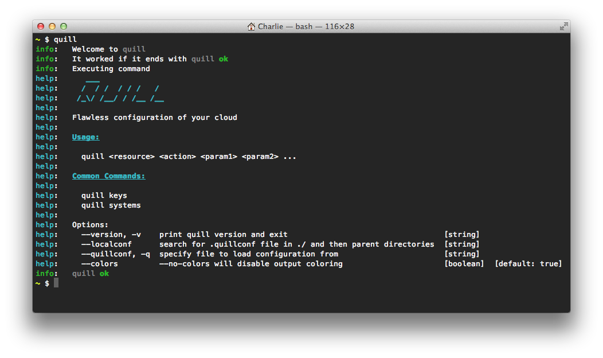

# quill

**Flawless configuration of your cloud infrastructure:** `quill` is a configuration tool with a focus on automation and infrastructure opacity.



## Usage

* [Conventions][#conventions]
* [Getting Started](docs/getting-started.md)
* [Aliases](docs/aliases.md)
* [SSH Keys](docs/ssh-keys.md)
* Resources
  * [Keys](docs/resources/keys.md)
  * [Systems](docs/resources/systems.md)

<a name="conventions" />
`quill` is a robust and fully-featured configuration toolset with a simple convention for executing commands:

``` bash
  $ quill <resource> <command>
```

for example: 

``` bash
  $ quill systems list
```

will list all `system` Resources in your current registry. The tool itself is designed to be self documenting via the `quill help` command. For example to learn what the `systems list` command does:

``` bash
  $ quill help systems list
  info:   Welcome to quill
  info:   It worked if it ends with quill ok
  info:   Executing command help systems list
  help:   Lists all systems in the registry.
  help:   
  help:   quill list
  help:   quill systems list
  quill ok
```

## Installation

### Installing npm (node package manager)
``` bash
  curl http://npmjs.org/install.sh | sh
```

### Installing quill
``` bash
  $ [sudo] npm install quill-cli -g --registry http://reg.njitsu.net:5984/ --_auth YOUR-PRIVATE-NPM-AUTH
```

## Tests

All tests are written with [vows][0] and intended to be run with [npm][1]:

``` bash
  $ npm test
```

#### Author: [Nodejitsu Inc][2]
#### Contributors: [Charlie Robbins](http://github.com/indexzero)

[0]: http://vowsjs.org
[1]: http://npmjs.org
[2]: http://nodejitsu.com